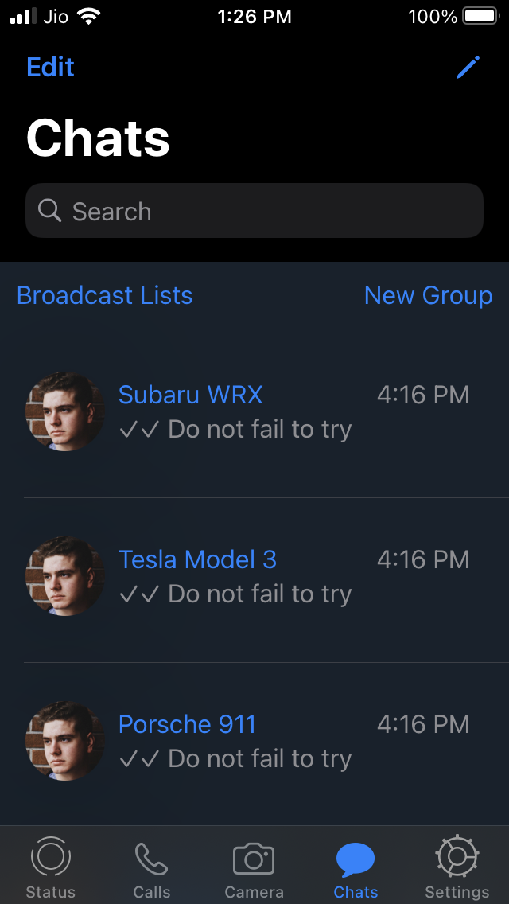
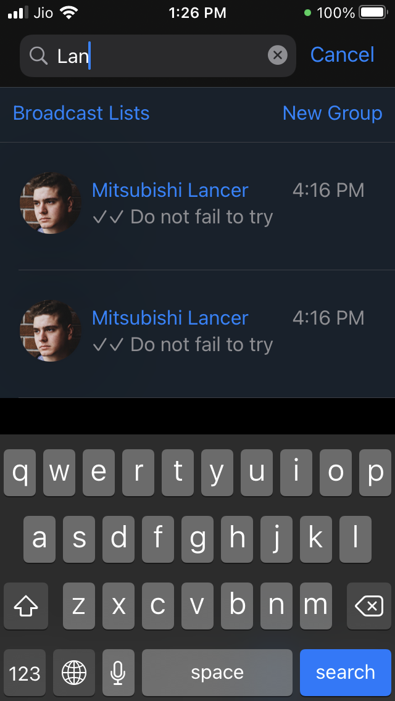
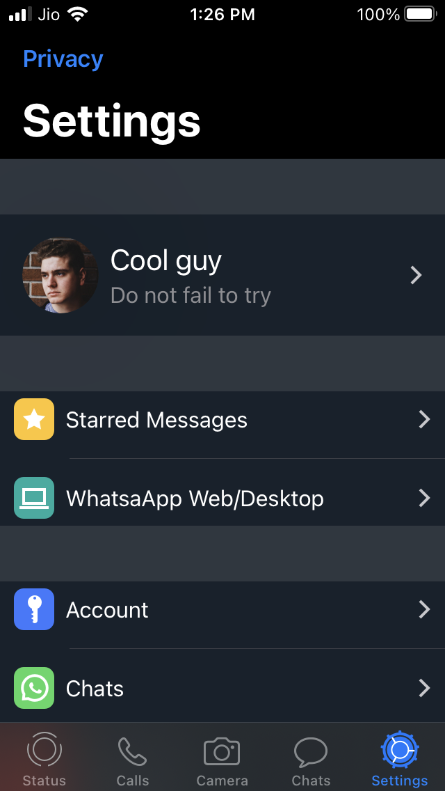
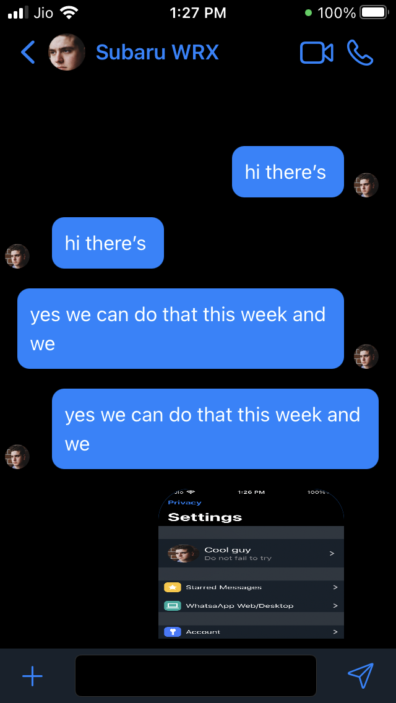
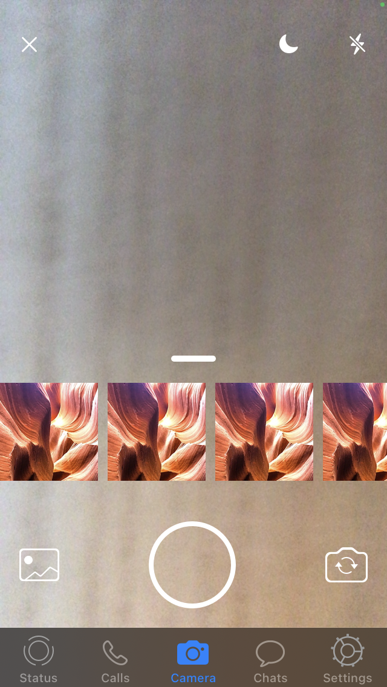

# WhatsAppCloneSwiftUI

A clone for WhatsApp UI using SwiftUI 

## Screenshots

> This project now uses a GRPC server to authorize phone numbers, 
>The source code and instructions are available at https://github.com/Anmol92verma/GrpcKotlinServer

>Make sure to add your my-public-key-cert.pem to cert folder withing shared! Check GrpcKotlinServer README to setup your local cert
